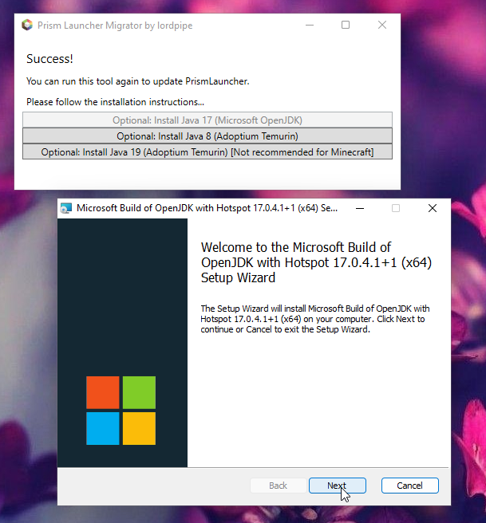

Prism Launcher Easy Migration Tool
===

This tool makes it easy to switch from PolyMC and MultiMC to PrismLauncher, and install multiple Java versions. It will automatically download the latest version, so it is always up to date.

Downloads: https://github.com/lordofpipes/PrismLauncherMigrator/releases

License
---

Copyright © lordpipe 2022

This program is free software: you can redistribute it and/or modify it under the terms of the GNU General Public License as published by the Free Software Foundation, either version 3 of the License, or (at your option) any later version.

This program is distributed in the hope that it will be useful, but WITHOUT ANY WARRANTY; without even the implied warranty of MERCHANTABILITY or FITNESS FOR A PARTICULAR PURPOSE.  See the GNU General Public License for more details.

You should have received a copy of the GNU General Public License along with this program.  If not, see \<https://www.gnu.org/licenses/\>.

